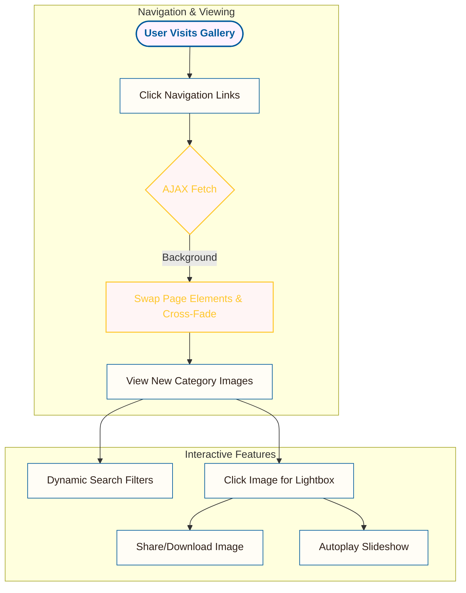

<div align="center">
  
  
  # ✨ Larsen & Toubro Limited Photo Gallery ✨
  
  **State-of-the-Art • Highly Fluid • Visually Stunning**
  
  A state-of-the-art, highly fluid, and visually stunning corporate photo gallery web application designed for **Larsen & Toubro Limited**. 
  
  [](https://photo-gallery-project-six.vercel.app)
  [](https://ashish-7142023.github.io/PHOTO-GALLERY-PROJECT/)
  [](https://developer.mozilla.org/en-US/docs/Web/HTML)
  [](https://developer.mozilla.org/en-US/docs/Web/CSS)
  [](https://developer.mozilla.org/en-US/docs/Web/JavaScript)

  ---
</div>

## 🎨 Visual Identity & Design Aesthetics

The user interface was crafted to match the premium, professional identity of **Larsen & Toubro**:

*   **Colors & Palette (Corporate Identity)**:
    *   **Light Mode**: Features clean modern slates.
    *   **Dark Mode**: Sleek dark theme leveraging deep slate backgrounds.
    *   **Accents**: L&T Classic Navy Blue (`#005a9c`) and Golden Amber accent (`#ffc72c`).
*   **Glassmorphic Elements**:
    *   Navigation headers and toolbars leverage backdrop filters (`blur(12px)`) and semi-transparent borders to create a premium frosted-glass aesthetic.
*   **Micro-Animations & Delighters**:
    *   **Transitions**: Interactive elements (category tags, layout togglers, nav links, and image cards) feature smooth transitions using organic cubic-bezier easing curves.
    *   **Staggered Card Entry**: Images load in sequence with staggered vertical slide animations on page load, creating a polished, professional entrance.

---

## ⚙️ Tech Stack & Architecture

This project is built from scratch without bulky third-party libraries, ensuring high performance, lightning-fast load times, and maximum control:

| Layer | Technology | Key Purpose / Feature |
| :--- | :--- | :--- |
| **Markup** | HTML5 | Semantic structured layout for modern SEO best practices. |
| **Styling** | Vanilla CSS3 | Custom properties, hardware-accelerated animations (`transform`/`opacity`), glassmorphism overlays, and fluid flexbox/grid systems. |
| **Interactivity** | Vanilla ES6+ JS | Modular logic, event delegation, and asynchronous fetch APIs. |
| **Graphics** | High-Res Assets | Curated SVG assets alongside high-resolution corporate photographs. |

---

## 🔄 Core Workflows & Logic




### 1. SPA-style AJAX Page Transitions
To prevent harsh, sudden page reloads, the gallery implements custom Single Page Application (SPA) routing:
*   Clicking navigation links triggers a background `fetch()` request.
*   The page header, sub-navigation, and image container drop in opacity, swap their contents with the new page elements in the background, and fade back up.
*   Browser back/forward history is fully supported using `history.pushState` and `popstate` events.

### 2. Control Toolbar Center
A floating control center sits below the navigation, enabling real-time workspace adjustments:
*   **Dynamic Search:** Filters photos instantly by title, description, or metadata in their `alt` texts.
*   **Auto-generated Category Pills:** Scans the active page's images and generates contextual filter pills (e.g. *Cake, Celebration, Plaque, Cupcakes*) automatically.
*   **Layout Switcher:** Instantly toggles between a balanced **Standard Grid** (fixed aspect ratio) and a **Pinterest Masonry Grid** (natural image proportions) with persistent user preference storage.
*   **Theme Mode:** Seamlessly swaps between a sleek dark theme and a corporate light theme.

### 3. Upgraded Lightbox & Utilities
Clicking any photo launches a full-screen, hardware-accelerated modal:
*   **Autoplay Slideshow:** Auto-advances through the active filters at a 3-second interval with Play/Pause state toggling.
*   **Link Sharing:** Copies the absolute URL of the active image directly to the clipboard.
*   **Photo Downloader:** Spawns virtual triggers to download the raw high-resolution image locally.
*   **Switching Cross-Fade:** Blurs and fades images during slide changes to remove sudden pops.
*   **Toast Notifications:** Injects non-blocking success alerts for download and copy activities.
*   **Safe Storage Wrapper:** A safety wrapper guards all storage operations, preventing browser security crashes when launching pages directly from local files (`file://` protocol).

---

## 📂 Project Directory Structure

```text
├── index.html             # Main entrypoint, Home & All Photos gallery
├── style.css              # Core styling, variables, animations, glassmorphism UI
├── gallery.js             # SPA interaction logic, routing, layout switcher
├── event.html             # Events category page
├── functions.html         # Functions category page
├── programmes.html        # Programmes category page
├── birthdays.html         # Birthdays category page
├── retirement.html        # Retirement category page
├── awards.html            # Awards category page
├── machines.html          # Machines category page
├── lsa.html               # Long Service Awards overview page
├── 25yrs.html, 30yrs.html # Long Service sub-pages
└── .vercel/               # Serverless deployment configuration
```

---

## 🚀 How to Run Locally

Since the application leverages AJAX requests (`fetch`), browsers restrict these operations on direct file schemas. You must serve the folder using a local web server:

### Option A: Using Python (Easiest)
1. Open your terminal in the project directory.
2. Run the following command:
   ```bash
   python -m http.server 8000
   ```
3. Open your browser and navigate to **[http://localhost:8000](http://localhost:8000)**.

### Option B: Using Node.js (npx)
1. Open your terminal in the project directory.
2. Run the following command:
   ```bash
   npx http-server -p 8000
   ```
3. Navigate to **[http://localhost:8000](http://localhost:8000)**.

---

## 🌐 Deployment

### GitHub Pages
1. Push your local repository to a remote GitHub repository.
2. Go to **Settings** > **Pages** inside your GitHub repository.
3. Select the branch (e.g., `main` or `master`) and directory (`/ (root)`), then click **Save**.

### Vercel
1. Install Vercel CLI locally (`npm install -g vercel`).
2. Run `vercel` from the root of the project directory.
3. Follow the CLI prompt setups to deploy.
